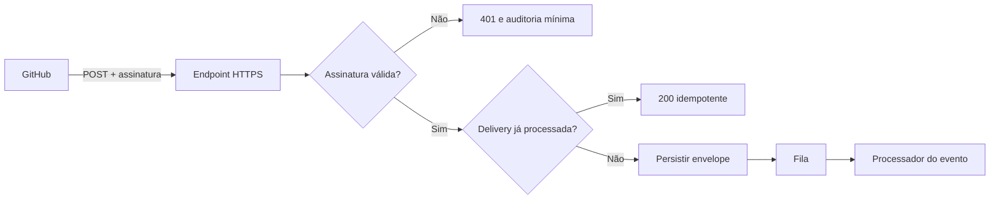

# GitHub Webhook Security Guide

Guia prático para receber webhooks do GitHub sem confiar cegamente no payload recebido.

Os exemplos mostram como validar `X-Hub-Signature-256` em PHP e Node.js usando comparação em tempo constante. O material é independente de framework e não contém código de nenhum produto comercial.

## Checklist mínimo

- Leia o corpo bruto da requisição antes de interpretar o JSON.
- Valide `X-Hub-Signature-256` com HMAC SHA-256.
- Use comparação em tempo constante.
- Rejeite assinaturas ausentes, malformadas ou inválidas.
- Guarde `X-GitHub-Delivery` para detectar entregas duplicadas; veja o [padrão de idempotência `claim → process → complete/fail`](docs/idempotency.md).
- Filtre os eventos permitidos pelo header `X-GitHub-Event`.
- Responda rapidamente e envie processamento pesado para uma fila.
- Nunca registre secrets ou payloads sensíveis sem política de retenção.

## Fluxo recomendado

## Idempotência e redeliveries

Assinatura válida não significa execução única. Uma redelivery do GitHub mantém o mesmo `X-GitHub-Delivery`, então o consumidor deve fazer um claim atômico antes de produzir efeitos e precisa tratar concorrência, worker interrompido, TTL e retries de forma explícita.

O guia [Idempotência de entregas com `X-GitHub-Delivery`](docs/idempotency.md) mostra um padrão independente de framework com SQL/Redis, leases, fencing token, retry/backoff e a janela crítica entre executar o efeito e marcar a delivery como concluída.

## Exemplos

| Plataforma | Implementação | Teste |
|---|---|---|
| PHP 8+ | [`examples/php/verify.php`](examples/php/verify.php) | `php tests/php-test.php` |
| Node.js 20+ | [`examples/node/verify.mjs`](examples/node/verify.mjs) | `node tests/node-test.mjs` |

Os exemplos recebem três valores: corpo bruto, header de assinatura e secret compartilhado.

## Configuração no GitHub

1. Abra **Settings → Webhooks → Add webhook** no repositório.
2. Use HTTPS no Payload URL.
3. Selecione `application/json`.
4. Gere um secret longo e aleatório.
5. Assine apenas os eventos necessários.
6. Faça uma entrega de teste e confira o resultado sem copiar o secret para logs.

## Defesa em profundidade

A assinatura comprova que o payload foi assinado com o secret compartilhado; ela não substitui autorização de negócio, idempotência, limites de tamanho, rate limiting, TLS ou controle de acesso ao painel de logs.

Consulte a [documentação oficial sobre validação de webhooks](https://docs.github.com/en/webhooks/using-webhooks/validating-webhook-deliveries).

## Segurança e contribuição

- Envie relatos sensíveis conforme a [política de segurança](.github/SECURITY.md); nunca abra secrets ou payloads reais em uma issue.
- Para propor testes, exemplos ou melhorias, leia o [guia de contribuição](CONTRIBUTING.md) e o [código de conduta](CODE_OF_CONDUCT.md).
- [Escolha uma tarefa para primeira contribuição](https://github.com/asllanmaciel/github-webhook-security-guide/issues?q=is%3Aissue%20state%3Aopen%20label%3A%22good%20first%20issue%22) ou [veja tudo que precisa de ajuda](https://github.com/asllanmaciel/github-webhook-security-guide/issues?q=is%3Aissue%20state%3Aopen%20label%3A%22help%20wanted%22).

## Licença

[MIT](LICENSE).
